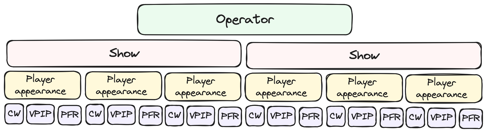
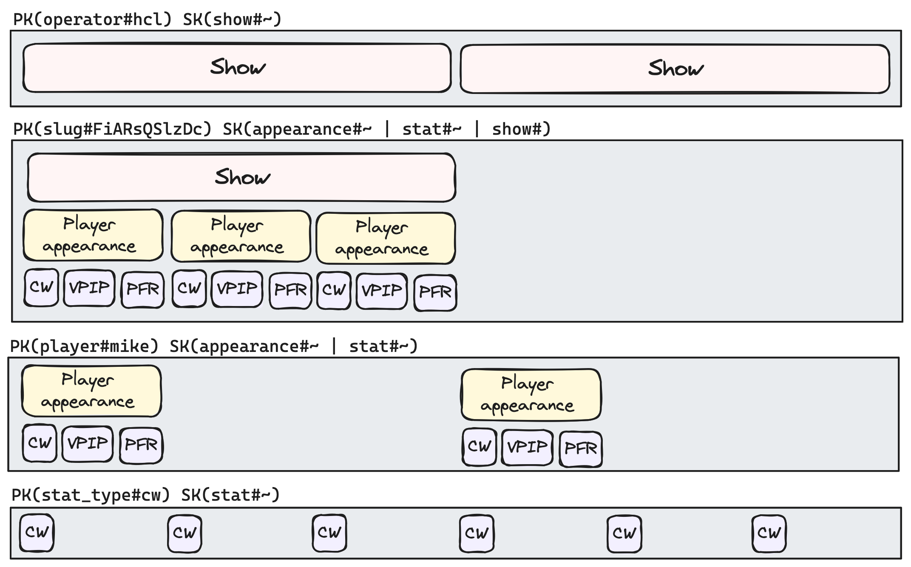

# Tracking Poker

During a streamed poker game, a show will collect a number of metrics related to player performance and style. Typical
metrics include:

-   _Cumulative winnings_ - The cumulative winnings (or losses) of a given player at the conclusion of the stream.
-   _Chip count_ - The size of a players stack at the conclusion of a stream.
-   _Pre-flop raise_ - The frequency at which a player elects to raise preflop.
-   _VPIP_ - How frequently players voluntarily enter a pot.

This project currently collects and aggregates these metrics for all players, from the most popular operator (HCL). This
provides some insight into the on-stream performance of players over time.

## Architecture

This project deploys a number of microservices to coordinate the collection of these statistics:


-   _[Asset Ripper](./asset-ripper/src/)_ - Downloads and slices streams into individual frames for analysis.
-   _[Frame Analysis](./frame-analysis/src)_ - Detects frames of interest and extracts statistics.

### Asset ripper

This service is responsible for downloading a segment of the target show and slicing out a number of individual frames
for further analysis.

Commands dispatched to this service can either be a video URL or ID and it will subsequently
dispatch details on the success of failure of the download and the individual frames extracted from the video. This
service is powered by:

-   `yt-dlp` - A python package written to download YouTube videos and metadata.
-   `ffmpeg` - The swiss army knife of video, used to extract individual frames.


### Frame analysis

This service is dispatched commands to do analysis on individual frames. The following takes place during
analysis:


1. A frame is taken as input.
    1. The service was tested with [35 random samples](./frame-analysis/src/__fixtures__/frames/) from the corpus.
    2. The samples were pre-labelled or validated at each stage of the analysis.
2. Frames are [preprocessed](./frame-analysis/src/preprocess/).
    1. The center area
       is [cropped](./frame-analysis/src/preprocess/__image_snapshots__/crop-middle-test-ts-crop-middle-crop-middle-of-0-pty-2-kp-rc-cw-3-jpg-1-snap.png).
    2. A [binary threshold](./frame-analysis/src/preprocess/__image_snapshots__/threshold-test-ts-crop-middle-crop-middle-of-0-pty-2-kp-rc-cw-3-jpg-1-snap.png)
       is applied to clear up noise.
3. OCR is applied to classify the frame as interesting or not.
    1. This service runs a classification process as a cost saving measure, since detailed analysis with the more
       accurate Textract service is costly.
    2. The OCR document is [fuzzy matched](./frame-analysis/src/classify/triggerWordsFoundInDocument.ts) to certain
       trigger words.
4. If classified as interesting, [Textract](https://aws.amazon.com/textract/) is used for a more accurate OCR.
    1. The results include words, tables and geometry of detected words.
5. The geometry of certain words are used to locate the arrows indicating if a figure represents a win or a loss.
    1. A [traditional algo](./frame-analysis/src/stats/up-down/) is applied to detect if a shape is an up or down arrow.
6. The extracted statistics are recorded.

### Inventory

The data model fits into the following hierarchy and relationships:



The inventory builds a read model using a DynamoDB table. On-demand pricing keeps costs minimal, because of the low
volume of writes, while CDNs with a high TTL can protect the read-workload.

The schema uses a single-table design, to support one-shot fetching of related entities. Partitions are designed along
the axis of operator, show, player and stat type to support the following queries:

1. All shows for a given operator.
2. All data for a given show.
3. All data given player.
4. All stats of a given type.

Visually each partition organises according the these access patterns in the following way:



The key schema to build these partitions is documented below:

```
{
    "entity_type": "show",
    "pk": "operator#hcl",
    "sk": "show#date#2024/01/23#slug#FiARsQSlzDc#",
    "gsi1pk": "slug#FiARsQSlzDc",
    "gsi1sk": "show#",
}
{
    "type": "player_appearance",
    "pk": "player#nikairball",
    "sk": "appearance#slug#FiARsQSlzDc#",
    "gsi1pk": "slug#FiARsQSlzDc",
    "gsi1sk": "appearance#player#nikairball#"
}
{
    "type": "player_stat",
    "pk": "slug#FiARsQSlzDc",
    "sk": "stat#stat_type#cw#player#nikairball#",
    "gsi1pk": "player#nikairball",
    "gsi1sk": "stat#stat_type#cw#show#FiARsQSlzDc#",
    "gsi2pk": "stat_type#cw",
    "gsi2sk": "stat#player#nikairball#slug#FiARsQSlzDc#",
}
```

For the volume of data produced by a single operator, each partition could grow by some order of magnitude before
impacting performance. Some of the most interesting insights come from data points spanning the whole dataset,
partitioning and querying aggregated statistics is not an infinitely scalable solution, but could be replaced with
running counts and averages.
