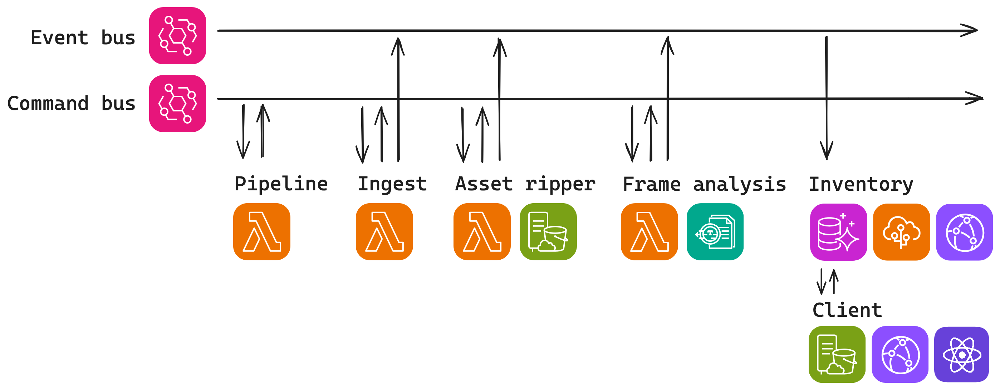
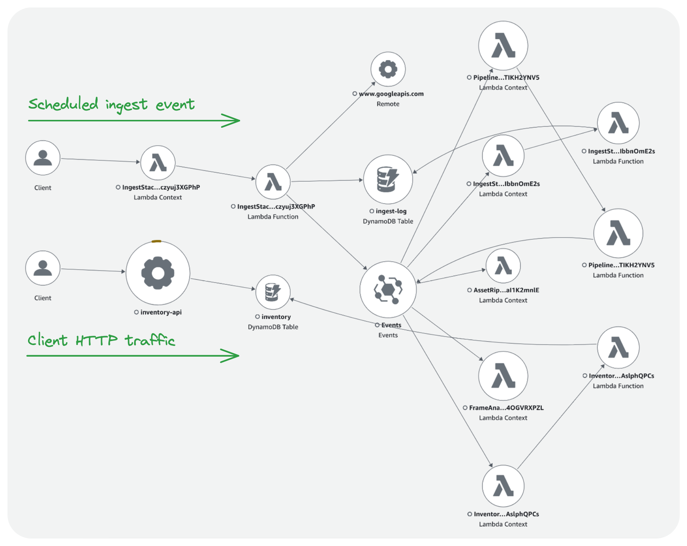

# Tracking Poker

During a streamed poker game, a show will collect a number of metrics related to player performance and style. Typical
metrics include:

-   _Cumulative winnings_ - The cumulative winnings (or losses) of a given player at the conclusion of the stream.
-   _Chip count_ - The size of a players stack at the conclusion of a stream.
-   _Pre-flop raise_ - The frequency at which a player elects to raise preflop.
-   _VPIP_ - How frequently players voluntarily enter a pot.

This project currently collects and aggregates these metrics for all players, from the most popular operator (HCL). This
provides some insight into the on-stream performance of players over time.

## Architecture

This project deploys a number of microservices to coordinate the collection of these statistics:



-   _[Pipeline](./pipeline/src/index.ts)_ - Routes events between services.
-   _[Ingest](./ingest/src/)_ - Queries for new video assets.
-   _[Asset Ripper](./asset-ripper/src/)_ - Downloads and slices streams into individual frames for analysis.
-   _[Frame Analysis](./frame-analysis/src)_ - Detects frames of interest and extracts statistics.
-   _[Inventory](./inventory/src)_ - Creates an API and useful read model for the statistics.
-   _[Client](./client/)_ - A front-end for consuming the statistics.

### Ingest

The ingest API is responsible for querying and dispatching new video assets into the pipeline. The service maintains
a [minimal read model](./ingest/src/projection/handler.ts) to keep track of videos that have already been discovered.


To ensure downstream services have access to the full range of metadata and encoded versions of the asset
a [fixed duration of time](./ingest/src/youtube/fetchRecentVideoIds.ts) after publishing must pass, before the asset is
considered discoverable.

### Asset ripper

This service is responsible for downloading a segment of the target show and slicing out a number of individual frames
for further analysis. Commands dispatched to this service can either be a [video ID or URL](./asset-ripper/src/api.ts).
Once assets are stored, their location and metadata are recorded.

This service is deployed with a custom [Dockerfile](./asset-ripper/Dockerfile) that brings in some additional
dependencies:

-   `yt-dlp` - A python package written to download YouTube videos and metadata.
-   `ffmpeg` - The swiss army knife of video, used to extract individual frames.


### Frame analysis

This service is dispatched commands to do analysis on individual frames. The following takes place during
analysis:


1. A frame is taken as input.
    1. The service was tested with [35 random samples](./frame-analysis/src/__fixtures__/frames/) from the corpus.
    2. The samples were pre-labelled or validated at each stage of the analysis with tests specifically suffixed with "
       DataBuilder".
    3. These tests assisted with an exploratory approach to understanding the data, and are thus distinct from the other
       tests, which have much more focused test cases.
2. Frames are [preprocessed](./frame-analysis/src/preprocess/).
    1. The center area
       is [cropped](./frame-analysis/src/preprocess/__image_snapshots__/crop-middle-test-ts-crop-middle-crop-middle-of-0-pty-2-kp-rc-cw-3-jpg-1-snap.png).
    2. A [binary threshold](./frame-analysis/src/preprocess/__image_snapshots__/threshold-test-ts-crop-middle-crop-middle-of-0-pty-2-kp-rc-cw-3-jpg-1-snap.png)
       is applied to clear up noise.
3. OCR is applied to classify the frame as interesting or not.
    1. This service runs a classification process as a cost saving measure, since detailed analysis with the more
       accurate Textract service is costly.
    2. The OCR document is [fuzzy matched](./frame-analysis/src/classify/triggerWordsFoundInDocument.ts) to certain
       trigger words.
4. If classified as interesting, [Textract](https://aws.amazon.com/textract/) is used for a more accurate OCR.
    1. The results include words, tables and geometry of detected words.
5. The geometry of certain words are used to locate the arrows indicating if a figure represents a win or a loss.
    1. A [traditional algo](./frame-analysis/src/stats/up-down/) is applied to detect if a shape is an up or down arrow.
6. The extracted statistics are recorded.

### Inventory

The data model fits into the following hierarchy and relationships:


The inventory builds a [read model](./inventory/src/projection/entity) using a DynamoDB table. On-demand pricing keeps
costs minimal, because of the low volume of writes, while CDNs with a high TTL can protect the read-workload.

The schema uses a single-table design, to support one-shot fetching of related entities. Partitions are designed along
the axis of operator, show, player and stat type to support the following queries:

1. [All shows for a given operator](./inventory/src/projection/queries/allShows.ts).
2. [All data for a given show](./inventory/src/projection/queries/allDataForShow.ts).
3. [All data given player](./inventory/src/projection/queries/allDataForPlayer.ts).
4. [All stats of a given type](./inventory/src/projection/queries/allStatsOfType.ts).

Visually each partition organises according the these access patterns in the following way:


The key schema to build these partitions is documented below:

```typescript
export type ShowStorage = Show & {
    entity_type: "show";
    pk: `operator#${OperatorId}`;
    sk: `show#date#${Date}#slug#${ShowId}#`;
    gsi1pk: `slug#${ShowId}`;
    gsi1sk: "show#";
};
type PlayerAppearanceStorage = PlayerAppearance & {
    entity_type: "player_appearance";
    pk: `player#${PlayerId}`;
    sk: `appearance#slug#${ShowId}#`;
    gsi1pk: `slug#${ShowId}`;
    gsi1sk: `appearance#player#${PlayerId}#`;
};
export type StatStorage = Stat & {
    entity_type: "player_stat";
    pk: `player#${PlayerId}`;
    sk: `stat#stat_type#${StatType}#slug#${ShowId}#`;
    gsi1pk: `slug#${ShowId}`;
    gsi1sk: `stat#stat_type#${StatType}#player#${PlayerId}#`;
    gsi2pk: `stat_type#${StatType}`;
    gsi2sk: `stat#player#${PlayerId}#slug#${ShowId}#`;
};
```

Some of the most interesting insights come from the aggregate of data points spanning the whole dataset. For the
volume of data produced by a single operator, each partition could grow by some order of magnitude before impacting
query performance. Querying for all data points then aggregating on demand, may eventually prove to not scale, but works
for the volume of data in the foreseeable future.

## Infrastructure

Where possible, all components use on-demand pricing (DynamoDB, ECS, Fargate), to keep costs low when infrastructure is
idle.

### Infrastructure-as-code

This project deploys to AWS using infrastructure-as-code via a number of [CDK Stacks](./infra/lib/). CDK provides
constructs at varying degrees of abstraction for orchestrating the creation of AWS services, using CloudFormation
templates as an intermediary.

### Observability

CloudWatch and X-Ray provide the foundation for logging and traces respectively. The "Trace Map" feature provides
a useful visualisation for tracking down the root cause of errors as commands and events propagate through services:



## The Results

The results are a number of leaderboards refreshed daily, with the ability to drill down on the players and shows that
are
interesting:


